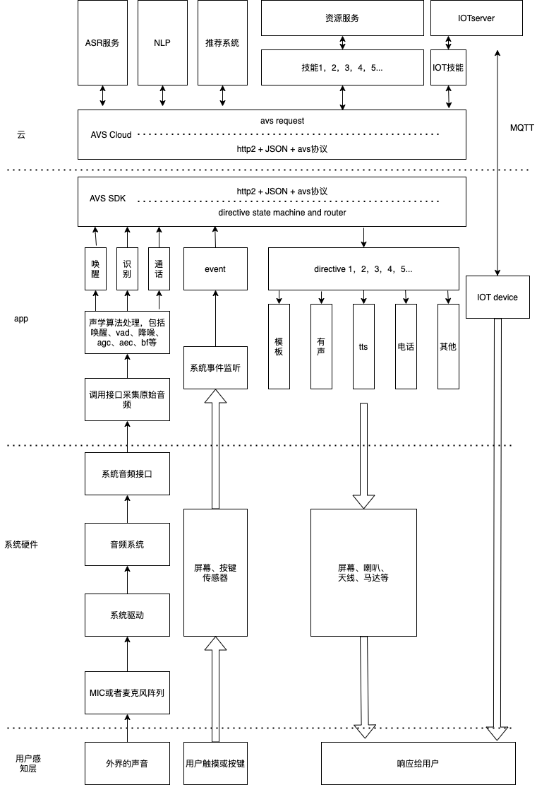

# 智能语音交互系统开发文档
此文档是一个完整的智能语音交互系统的完整的开发过程，其中包括了数据的采集、数据的处理、语音理解、内容整合、内容分发、数据展示等主要核心过程以及每个过程我能想到的所有的知识点，
此为记录，作为一个入行两年的总结，也便日后翻看。

我学习一个东西的整体思路是整体到局部，因此在这篇文章的构思中，我也是先是列出了整个智能语音交互系统的模块大纲，然后再为各个模块添枝加叶，在这个过程中不断整理自己的知识树，也顺便查缺补漏，
补充一些知识的漏洞，更能够找到需要的新的知识领域，进行有效的探索

希望经过一段时间后可以更加深刻的理解整个语音交互链条，能为接下来更进一步打下坚实的基础。

接下来我将按照这样的大致如下的思路去写每一个模块：
1. 架构
2. 实现思路
3. 理论基础
4. 代码实现和示例

## 整体架构




## 硬件选型与结构设计

## 声学性能测试

## 录音

### 标准录音

### 蓝牙录音

1. 设置通话模式

   ```kotlin
   mAudioManager?.mode = AudioManager.MODE_IN_COMMUNICATION
   ```

2. 开启sco连接

   ```kotlin
   mAudioManager?.startBluetoothSco()
   ```

3. 监听sco连接广播

```kotlin
AudioManager.ACTION_SCO_AUDIO_STATE_UPDATED -> {
    val state = intent.getIntExtra(AudioManager.EXTRA_SCO_AUDIO_STATE, AudioManager.SCO_AUDIO_STATE_ERROR)
    when(state){
        AudioManager.SCO_AUDIO_STATE_CONNECTED ->{
            bluetoothHeadetScoConnectionChanged(true)
        }
    }
}
```

4. 通知Audio sco已建立

```kotlin
 mAudioManager?.setBluetoothScoOn(false)
```


### 多麦克风阵列拾音


## 播放器

## 信号处理

### 唤醒

### 降噪

#### Android系统自带降噪

### AEC

#### Android系统自带AEC

### 波束形成

### AGC

#### Android系统自带AGC

### 人声检测

## SDK状态机和对话管理

## AVS协议

## Vsi服务

## Skill

## NLP

## ASR

## TTS

## 应用及场景

### 免唤醒的技术方案

## 总结
