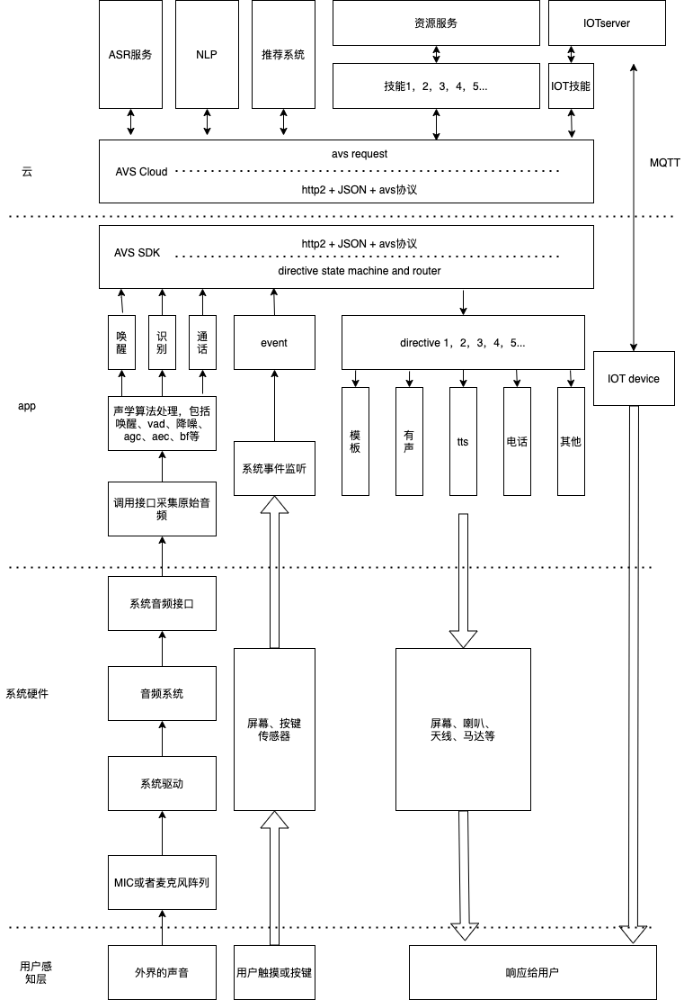

# 智能语音交互系统开发文档
此文档是一个完整的智能语音交互系统的完整的开发过程，其中包括了数据的采集、数据的处理、语音理解、内容整合、内容分发、数据展示等主要核心过程以及每个过程我能想到的所有的知识点，
此为记录，作为一个入行两年的总结，也便日后翻看。

我学习一个东西的整体思路是整体到局部，因此在这篇文章的构思中，我也是先是列出了整个智能语音交互系统的模块大纲，然后再为各个模块添枝加叶，在这个过程中不断整理自己的知识树，也顺便查缺补漏，
补充一些知识的漏洞，更能够找到需要的新的知识领域，进行有效的探索

希望经过一段时间后可以更加深刻的理解整个语音交互链条，能为接下来更进一步打下坚实的基础。

接下来我将按照这样的大致如下的思路去写每一个模块：
1. 架构
2. 实现思路
3. 理论基础
4. 代码实现和示例

## 整体架构



该系统的核心框架是借鉴了亚马逊的AVS系统，他将语音系统的入口抽象成了ASR音频的输入，屏蔽了各种不同的平台，设备型号，mic阵列，判定方式（唤醒、手动触发、其他传感器触发等）等设备差异，统一限制为作为语音识别基础的16k 16bit 1ch的pcm原始音频流的输入，音频通过h2+AVS协议传输到云端，作为整个云端大脑的入参，云端大脑调用深度学习的语言模型将语音流转换成自然语音的文字，然后将文字经过自然语音理解的模块将一串文字进行意图的分解，尝试转换成程序可以理解的协议，协议将意图首先划分成一些约定俗成的有限分类，我们将对应的不同分类的处理器叫做skill,skill负责处理将理解到的意图进行处理，做出尽可能人性化的响应，最终形成大脑的对于此次输入的反馈，反馈是有一个命令集合组成，他统一由大脑返回给设备端，设备按照大脑下发的指令集，做出对响应，此处我们对于指令也有一个约定俗成的有限分类，并事先安排了对应的处理器，接收到指令之后分别交给它处理即可。

此种架构为云端为核心的架构，即所有的指令下发由云端大脑下发，为了做到这一点，云端必须知道所有的端侧状态，这样做的好处显而易见：

1. 端侧处理器有限且固定，类似浏览器一样
2. 内容变动和内容的丰富无需端侧变动和升级，只要云端修改即可
3. 负责决策的大脑的计算能力不受限于端侧平台限制
4. 意图的处理能力易扩展

当然这样做的弊端也是很明显的：

1. 端侧所有的状态必须上报云端，以及只能做出约定的响应
2. 输入流对于系统的网络传输要求较高
3. 对于富界面交互支持不够友好，对于端侧自定义扩展不够友好
4. 统一输入依然遗留了复杂的声学处理在端侧

## 硬件选型与结构设计

## 声学性能测试

## 拾音设备

## 录音

对于整个软件层面的语音交互系统而言，音频是整个系统的输入，是整个智能语音系统的需要进行处理的原始材料，其质量的好坏直接关系到后续处理的难度、复杂度，也直接影响到最终产生的结果的精准度。作为一个成熟可靠的智能语音系统，必须尽可能的在这个层面上可以采集到尽可能准确、信噪比较高的原始音频，尽可能在音频采集的环节去贴合实际的使用场景，为后续的信号处理、语音识别等准备优良的原材料。具体到不同的智能硬件平台上，就存在这各种各样的音频来源和音频录取的方式，我们需要熟悉这些不同方式的实现方式和使用场景。

对于这个环节来说，原则应该是能近不远，远近切换，能多不少，多少切换，能高不低，高低切换。也就是说，在场景设计的时候，我们要尽可能的借助一些具有拾音功能便携式设备，通过一些近场通信手段，实现远场拾音场景的近场化，这么做的原因是当前的智能语音识别对于近场语音的识别率已经达到了非常可观的准确率，但对于远场的处理只能在相对苛刻的部分条件下才能实现近场同样的识别率，而且在稍微负责的交互场景下，远场识别会出现非常迅速的劣化，因此我们在能够使用近场的情况下，尽可能的使用近场做为拾音手段，如果某些必须是配置远场的场景下，也尽可能的做到部分场景的近场化补充；能多不少是指，在算力允许的情况下，我们尽可能的使用多麦克风阵列作为拾音终端，经过精心设计的多麦克风阵列可以为后续的语音前端信号处理提供更多，也更精准的原始数据，通过多维度信息的计算，可以使得信号处理给出信噪比更好的识别路信号，以提高后续的语音识别率，使其更接近进场的识别效果；能高不低就不用进行详述了，我们当然是想办法提供尽可能信噪比更高的音频，为此我们尽可能在录取音频的阶段就对此进行评估，尽可能在物理上达到信噪比的最大化，不要依赖后续的信号处理、机器学习的模型试图去实现低信噪比的高识别率，目前看来这种想要依赖智能算法来达成全场景适配的是不太理想的，且跟模型训练的数据集覆盖的领域和场景关联性很强，但实际的使用场景的复杂性，使得我们无法组织和收集到全量的数据来作为训练语料。

另外一个录音过程中我们需要注意的的一个非常重要的问题是回声的问题，麦克风拾音设备自身播放出来的声音，因为距离自身麦克风较近，一旦被拾取进去，基本会覆盖掉有效的声源的声音，造成声源的语音指令无法被正确识别。为了避免这种情况我们需要在拾音的设计上提前考虑，可以采取的措施有：

1. 降噪较好的TWS耳机的类型，mic和speaker做好物理隔离，使得speaker的声音尽可能少的被mic拾取进去；
2. mic、speaker尽可能离得远一些，使得mic能够拾取到的speaker播放音频能量尽可能的低，以避免对有效声源造成干扰；
3. 提供与播放音频拟合程度好的回采信号，给到信号处理算法进行AEC回声消除算法

接下来我们主要对Android平台的各种录音方式进行说明:

### 标准录音API

使用Android设备进行智能语音开发，必须要了解Android提供的标准录音接口，此接口提供了在标准Android设备上进行录取流式音频的简单易用的方式，使用该接口我们可以很简单的从标准Android设备所能支持的音频设备中录取音频。

主要参考：[AudioRecord](https://developer.android.google.cn/reference/android/media/AudioRecord?hl=en)

1. 创建AudioRecord

   ```kotlin
       private var mAudioRecord: AudioRecord ? = null
       //回声消除
       private var mAEC: AcousticEchoCanceler ? = null
   
       //录音采集的来源，如系统mic、有线耳机mic等
       private var mAudioSource: Int = MediaRecorder.AudioSource.MIC
       //采样率，智能语音系统后续处理一般使用16k的原始音频，所以如果能满足的情况下，一般选择16k的采样率进行采样
       //如果系统不支持16K,可以选择44.1k或者其他采样率，然后通过降采样之后进行使用
       private var mAudioSampleRate: Int = 16000;
       //通道数，使用智能手机的情况下，一般选择一通道数据，作为近场语音的输入
       //特殊系统下，我们可以通过修改系统framework的音频的方式，将音频编码
       //通过AudioRecrod将其录制出来，AudioRecord一般默认支持2通道
       private var mAudioChanalConfig: Int =  AudioFormat.CHANNEL_IN_MONO
       //智能语音系统一般使用16bit的采样位深
       private var mAudioBitDepth: Int =  AudioFormat.ENCODING_PCM_16BIT
       //获取录音需要的buffer
       private var mAudioBuffer: Int = AudioRecord.getMinBufferSize(mAudioSampleRate,mAudioChanalConfig,mAudioBitDepth)
       //每次采集的buffer
       private var mAudioBufferPerFrame: ByteArray = ByteArray(32 * 16 )
   
   		mAudioRecord = AudioRecord(mAudioSource, mAudioSampleRate, mAudioChanalConfig, mAudioBitDepth, mAudioBuffer)
   ```

上述过程比较简单，需要注意的是AudioSource、采样率、采样位深的不同的试用场景

AudioSource在手机上使用的情况下，一般直接选择Mic来录取手机自带麦克风的音频，有线耳机mic以及其他通过3.5cm耳机孔接入的有线、无线的麦克风一般设置为Default即可；

采样率在AudioRecord的官方说明中，44100hz是所有平台均可以支持的采样率，其他的采样率需要根据具体的平台的属性判断是否支持，一般在智能语音系统中的前端语音处理模块需要的音频是16000k, 所以在一般的设备上可以选择16000k即可；

采样位深在一般的Android设备上一般都是选择16bit即可，至于为什么选择16bit呢？

是因为 $2^{16}=65536$,能够表示20log(65536)约等于96dB的动态范围，对于一般的前端信号处理和语音识别来说够用了。 

另外在比较新的Android平台上一般自身提供了较好的回声消除算法，使用该回声消除算法，录取的音频中可以很好的去除掉本身喇叭播出来的声音的影响，其使用方法可以参考Audio Record示例

2. 开始录音

   ````kotlin
   try{
       mAudioRecord?.startRecording()
   }catch(ex: IllegalStateException){
       ex.stackTrace
   }
   ````

3. 创建录音线程，循环读取buffer

   因为read是耗时操作，所以需要在子线程中操作，创建读取线程，在读取线程中获取buffer，并将其直接送到后端的音频前端处理模块进行处理即可

   ``` kotlin
       private inner class AudioRecordRunnable :Runnable{
           override fun run() {
               mIsRecording = true
               while (mIsRecording){
                   var size = mAudioRecord?.read(mAudioBufferPerFrame,0,mAudioBufferPerFrame.size)
                   size.let {
                       if(it!! > 0){
                           mSavedDataSize = mSavedDataSize + size!!
                           runOnUiThread {
                               mReadDateSize.setText("已录取音频，大小为: ${mSavedDataSize}")
                           }
   //                      writeFile(mAudioBufferPerFrame,"/sdcard/record.pcm",true)
                       }
                   }
               }
           }
   
       }
   
       var thread: Thread = Thread(AudioRecordRunnable())
       thread.start()
   ```


使用示例：https://github.com/Jiesean/Jiesean-Personal-Notes/tree/master/audiorecord

### 蓝牙HSP录音

在使用手机这类移动设备，尤其标准的Android手机、IOS手机，一般都支持通过蓝牙协议连接外设，这样的外设包括TWS耳机、车载系统、智能手表、智能手环、智能眼镜等等，以Android为例，因为Android手机是标准的，在Android手机上可以支持从外设中进行音频录取的方法并不多，蓝牙虽然具有丰富的协议，但一般应用开发的场景，是没有能力去进行对端，即智能外设一侧的开发的，因而我们只能在智能外设和手机连接并支持的蓝牙协议中寻找一个可以进行音频传输的协议来实现我们想要的效果。

通过分析，我们知道几乎所有拥有语音功能的外设都支持通过蓝牙进行通话，蓝牙通话，是需要进行语音的双工通信的，即从智能外设中将语音传输到手机端，然后从手机端将音频发送到外设端。我们可以利用这个成熟的电话协议的录音功能，采集智能外设中的音频，以将多数的远场语音场景，转换成近场。

其中以Android平台为例，提供了从支持HSP协议的蓝牙外设中录取音频的方法如下：

1. 设置通话模式

   此处大部分Android手机平台上，将Mode设置为COMMUNICATION即可，但是在实际测试中发现**部分华为手机**需要设置为AudioManager.MODE_IN_CALL，将他们设置为 COMMUNICATION 后，音频来源会是手机的mic，而猜测是华为对手机系统进行了魔改，随着Android系统的规范，他并没有随之进行规范自己的接口，所以导致了这样的问题

   ```kotlin
   mAudioManager?.mode = AudioManager.MODE_IN_COMMUNICATION
   ```

2. 开启sco连接

   ```kotlin
   mAudioManager?.startBluetoothSco()
   ```

3. 监听sco连接广播

```kotlin
AudioManager.ACTION_SCO_AUDIO_STATE_UPDATED -> {
    val state = intent.getIntExtra(AudioManager.EXTRA_SCO_AUDIO_STATE, AudioManager.SCO_AUDIO_STATE_ERROR)
    when(state){
        AudioManager.SCO_AUDIO_STATE_CONNECTED ->{
            bluetoothHeadetScoConnectionChanged(true)
        }
    }
}
```

4. 通知Audio sco已建立

```kotlin
 mAudioManager?.setBluetoothScoOn(false)
```

5. 开启录音

   开启录音的方式如上节所述的AudioRecord的方法相同，只是在设置AudioSource的时候需要将其设置为 MediaRecorder.AudioSource.VOICE_COMMUNICATION


从实际的设备上的测试效果来看，使用HSP SCO链路从TWS耳机或者车载蓝牙录音的方式，具有以下的几个有点：

1. 实现简单，可以复用当前成熟的蓝牙协议，可以直接在应用程序层进行开发，无需改动对端的实现即可。
2. 基于1的原因，此种方案可以适用于绝大多数手机 + 蓝牙 + 蓝牙耳机的中，通用性良好
3. 使用TWS作为录音前端，因为TWS一般做了较好的物理隔绝，同时在耳机一般都做了通话降噪，其中也包括AEC算法在内，如果只是想实现某些应用层面的效果，可以充分利用这些已有的成熟机制。

该方案除了上述优点，在实际的体验中，也存在很多确定明显的缺点：

1. sco链路在Android上的实现并不是很完善，存在很多设备上不稳定的情况，尤其和音频模块、电话模块、音乐模块相互杂糅的交互场景下，会存在很多异常bug,且以华为为例的部分手机品牌在API使用上也不标准，需要趟坑
2. sco链路是一种面向连接的同步传输链路，其传输数据不包含crc校验，也不进行重传，以保证数据的实时性为第一目标，主要用来传输实时语音，因此使用sco链路来作为耳机到手机的音频输入是没有任何问题的，但是如果同时使用sco链路作为手机端音频播放的到耳机端的高清音频的传输协议，如播放音乐等，那么在耳机端听到的音质会因为丢包等问题变差。目前在不改动系统或者耳机程序的情况下，没有理想的解决办法

使用示例：https://github.com/Jiesean/Jiesean-Personal-Notes/tree/master/audiorecord

### 蓝牙SPP录音

### 蓝牙BLE录音

### 多麦克风阵列拾音

## 音频传输

### Opus

## 播放器

## 信号处理

### 唤醒

### 降噪

#### Android系统自带降噪

### AEC

#### Android系统自带AEC

### 波束形成

### AGC

#### Android系统自带AGC

### 人声检测

## SDK状态机和对话管理

## AVS协议

## VSI服务

## Skill

## NLP

## ASR

## TTS

## IOT

## 应用及场景

### 免唤醒的技术方案

## 总结

