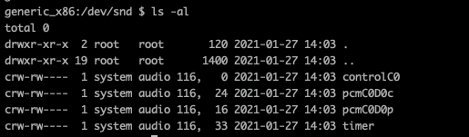

# 智能语音交互系统开发文档
此文档是一个完整的智能语音交互系统的完整的开发过程，其中包括了数据的采集、数据的处理、语音理解、内容整合、内容分发、数据展示等主要核心过程以及每个过程我能想到的所有的知识点，
此为记录，作为一个入行两年的总结，也便日后翻看。

我学习一个东西的整体思路是整体到局部，因此在这篇文章的构思中，我也是先是列出了整个智能语音交互系统的模块大纲，然后再为各个模块添枝加叶，在这个过程中不断整理自己的知识树，也顺便查缺补漏，
补充一些知识的漏洞，更能够找到需要的新的知识领域，进行有效的探索

希望经过一段时间后可以更加深刻的理解整个语音交互链条，能为接下来更进一步打下坚实的基础。

接下来我将按照这样的大致如下的思路去写每一个模块：
1. 架构
2. 实现思路
3. 理论基础
4. 代码实现和示例

## 整体架构


该系统的核心框架是借鉴了亚马逊的AVS系统，他将语音系统的入口抽象成了ASR音频的输入，屏蔽了各种不同的平台，设备型号，mic阵列，判定方式（唤醒、手动触发、其他传感器触发等）等设备差异，统一限制为作为语音识别基础的16k 16bit 1ch的pcm原始音频流的输入，音频通过h2+AVS协议传输到云端，作为整个云端大脑的入参，云端大脑调用深度学习的语言模型将语音流转换成自然语音的文字，然后将文字经过自然语音理解的模块将一串文字进行意图的分解，尝试转换成程序可以理解的协议，协议将意图首先划分成一些约定俗成的有限分类，我们将对应的不同分类的处理器叫做skill,skill负责处理将理解到的意图进行处理，做出尽可能人性化的响应，最终形成大脑的对于此次输入的反馈，反馈是有一个命令集合组成，他统一由大脑返回给设备端，设备按照大脑下发的指令集，做出对响应，此处我们对于指令也有一个约定俗成的有限分类，并事先安排了对应的处理器，接收到指令之后分别交给它处理即可。

此种架构为云端为核心的架构，即所有的指令下发由云端大脑下发，为了做到这一点，云端必须知道所有的端侧状态，这样做的好处显而易见：

1. 端侧处理器有限且固定，类似浏览器一样
2. 内容变动和内容的丰富无需端侧变动和升级，只要云端修改即可
3. 负责决策的大脑的计算能力不受限于端侧平台限制
4. 意图的处理能力易扩展

当然这样做的弊端也是很明显的：

1. 端侧所有的状态必须上报云端，以及只能做出约定的响应
2. 输入流对于系统的网络传输要求较高
3. 对于富界面交互支持不够友好，对于端侧自定义扩展不够友好
4. 统一输入依然遗留了复杂的声学处理在端侧

## 硬件选型与结构设计

## 声学性能测试

## 拾音设备

## 录音

对于整个软件层面的语音交互系统而言，音频是整个系统的输入，是整个智能语音系统的需要进行处理的原始材料，其质量的好坏直接关系到后续处理的难度、复杂度，也直接影响到最终产生的结果的精准度。作为一个成熟可靠的智能语音系统，必须尽可能的在这个层面上可以采集到尽可能准确、信噪比较高的原始音频，尽可能在音频采集的环节去贴合实际的使用场景，为后续的信号处理、语音识别等准备优良的原材料。具体到不同的智能硬件平台上，就存在这各种各样的音频来源和音频录取的方式，我们需要熟悉这些不同方式的实现方式和使用场景。

对于这个环节来说，原则应该是能近不远，远近切换，能多不少，多少切换，能高不低，高低切换。也就是说，在场景设计的时候，我们要尽可能的借助一些具有拾音功能便携式设备，通过一些近场通信手段，实现远场拾音场景的近场化，这么做的原因是当前的智能语音识别对于近场语音的识别率已经达到了非常可观的准确率，但对于远场的处理只能在相对苛刻的部分条件下才能实现近场同样的识别率，而且在稍微负责的交互场景下，远场识别会出现非常迅速的劣化，因此我们在能够使用近场的情况下，尽可能的使用近场做为拾音手段，如果某些必须是配置远场的场景下，也尽可能的做到部分场景的近场化补充；能多不少是指，在算力允许的情况下，我们尽可能的使用多麦克风阵列作为拾音终端，经过精心设计的多麦克风阵列可以为后续的语音前端信号处理提供更多，也更精准的原始数据，通过多维度信息的计算，可以使得信号处理给出信噪比更好的识别路信号，以提高后续的语音识别率，使其更接近进场的识别效果；能高不低就不用进行详述了，我们当然是想办法提供尽可能信噪比更高的音频，为此我们尽可能在录取音频的阶段就对此进行评估，尽可能在物理上达到信噪比的最大化，不要依赖后续的信号处理、机器学习的模型试图去实现低信噪比的高识别率，目前看来这种想要依赖智能算法来达成全场景适配的是不太理想的，且跟模型训练的数据集覆盖的领域和场景关联性很强，但实际的使用场景的复杂性，使得我们无法组织和收集到全量的数据来作为训练语料。

另外一个录音过程中我们需要注意的的一个非常重要的问题是回声的问题，麦克风拾音设备自身播放出来的声音，因为距离自身麦克风较近，一旦被拾取进去，基本会覆盖掉有效的声源的声音，造成声源的语音指令无法被正确识别。为了避免这种情况我们需要在拾音的设计上提前考虑，可以采取的措施有：

1. 降噪较好的TWS耳机的类型，mic和speaker做好物理隔离，使得speaker的声音尽可能少的被mic拾取进去；
2. mic、speaker尽可能离得远一些，使得mic能够拾取到的speaker播放音频能量尽可能的低，以避免对有效声源造成干扰；
3. 提供与播放音频拟合程度好的回采信号，给到信号处理算法进行AEC回声消除算法

接下来我们主要对Android平台的各种录音方式进行说明:

### 标准录音API

使用Android设备进行智能语音开发，必须要了解Android提供的标准录音接口，Android提供的录音接口有两个

- MediaRecorder 提供音频读取并保存成文件，是AudioRecord的封装，使用简单，但不灵活
- AudioRecord 提供音频读取并流式存取，使用相对复杂，但是灵活

因为实时语音系统需要流式的音频，因此我们此处主要讨论AudioRecord的使用方法：

主要参考：[AudioRecord](https://developer.android.google.cn/reference/android/media/AudioRecord?hl=en)

1. 创建AudioRecord

   ```kotlin
       private var mAudioRecord: AudioRecord ? = null
       //回声消除
       private var mAEC: AcousticEchoCanceler ? = null
   
       //录音采集的来源，如系统mic、有线耳机mic等
       private var mAudioSource: Int = MediaRecorder.AudioSource.MIC
       //采样率，智能语音系统后续处理一般使用16k的原始音频，所以如果能满足的情况下，一般选择16k的采样率进行采样
       //如果系统不支持16K,可以选择44.1k或者其他采样率，然后通过降采样之后进行使用
       private var mAudioSampleRate: Int = 16000;
       //通道数，使用智能手机的情况下，一般选择一通道数据，作为近场语音的输入
       //特殊系统下，我们可以通过修改系统framework的音频的方式，将音频编码
       //通过AudioRecrod将其录制出来，AudioRecord一般默认支持2通道
       private var mAudioChanalConfig: Int =  AudioFormat.CHANNEL_IN_MONO
       //智能语音系统一般使用16bit的采样位深
       private var mAudioBitDepth: Int =  AudioFormat.ENCODING_PCM_16BIT
       //获取录音需要的buffer
       private var mAudioBuffer: Int = AudioRecord.getMinBufferSize(mAudioSampleRate,mAudioChanalConfig,mAudioBitDepth)
       //每次采集的buffer
       private var mAudioBufferPerFrame: ByteArray = ByteArray(32 * 16 )
   
   		mAudioRecord = AudioRecord(mAudioSource, mAudioSampleRate, mAudioChanalConfig, mAudioBitDepth, mAudioBuffer)
   ```

上述过程比较简单，需要注意的是AudioSource、采样率、采样位深的不同的试用场景

AudioSource在手机上使用的情况下，一般直接选择Mic来录取手机自带麦克风的音频，有线耳机mic以及其他通过3.5cm耳机孔接入的有线、无线的麦克风一般设置为Default即可；

采样率在AudioRecord的官方说明中，44100hz是所有平台均可以支持的采样率，其他的采样率需要根据具体的平台的属性判断是否支持，一般在智能语音系统中的前端语音处理模块需要的音频是16000k, 所以在一般的设备上可以选择16000k即可；

采样位深在一般的Android设备上一般都是选择16bit即可，至于为什么选择16bit呢？

是因为 $2^{16}=65536$,能够表示20log(65536)约等于96dB的动态范围，对于一般的前端信号处理和语音识别来说够用了。 

另外在比较新的Android平台上一般自身提供了较好的回声消除算法，使用该回声消除算法，录取的音频中可以很好的去除掉本身喇叭播出来的声音的影响，其使用方法可以参考Audio Record示例

2. 开始录音

   ````kotlin
   try{
       mAudioRecord?.startRecording()
   }catch(ex: IllegalStateException){
       ex.stackTrace
   }
   ````

3. 创建录音线程，循环读取buffer

   因为read是耗时操作，所以需要在子线程中操作，创建读取线程，在读取线程中获取buffer，并将其直接送到后端的音频前端处理模块进行处理即可

   ``` kotlin
       private inner class AudioRecordRunnable :Runnable{
           override fun run() {
               mIsRecording = true
               while (mIsRecording){
                   var size = mAudioRecord?.read(mAudioBufferPerFrame,0,mAudioBufferPerFrame.size)
                   size.let {
                       if(it!! > 0){
                           mSavedDataSize = mSavedDataSize + size!!
                           runOnUiThread {
                               mReadDateSize.setText("已录取音频，大小为: ${mSavedDataSize}")
                           }
   //                      writeFile(mAudioBufferPerFrame,"/sdcard/record.pcm",true)
                       }
                   }
               }
           }
   
       }
   
       var thread: Thread = Thread(AudioRecordRunnable())
       thread.start()
   ```


使用示例：https://github.com/Jiesean/Jiesean-Personal-Notes/tree/master/audiorecord

### 蓝牙HSP录音

在使用手机这类移动设备，尤其标准的Android手机、IOS手机，一般都支持通过蓝牙协议连接外设，这样的外设包括TWS耳机、车载系统、智能手表、智能手环、智能眼镜等等，以Android为例，因为Android手机是标准的，在Android手机上可以支持从外设中进行音频录取的方法并不多，蓝牙虽然具有丰富的协议，但一般应用开发的场景，是没有能力去进行对端，即智能外设一侧的开发的，因而我们只能在智能外设和手机连接并支持的蓝牙协议中寻找一个可以进行音频传输的协议来实现我们想要的效果。

通过分析，我们知道几乎所有拥有语音功能的外设都支持通过蓝牙进行通话，蓝牙通话，是需要进行语音的双工通信的，即从智能外设中将语音传输到手机端，然后从手机端将音频发送到外设端。我们可以利用这个成熟的电话协议的录音功能，采集智能外设中的音频，以将多数的远场语音场景，转换成近场。

其中以Android平台为例，提供了从支持HSP协议的蓝牙外设中录取音频的方法如下：

1. 设置通话模式

   此处大部分Android手机平台上，将Mode设置为COMMUNICATION即可，但是在实际测试中发现**部分华为手机**需要设置为AudioManager.MODE_IN_CALL，将他们设置为 COMMUNICATION 后，音频来源会是手机的mic，而猜测是华为对手机系统进行了魔改，随着Android系统的规范，他并没有随之进行规范自己的接口，所以导致了这样的问题

   ```kotlin
   mAudioManager?.mode = AudioManager.MODE_IN_COMMUNICATION
   ```

2. 开启sco连接

   ```kotlin
   mAudioManager?.startBluetoothSco()
   ```

3. 监听sco连接广播

```kotlin
AudioManager.ACTION_SCO_AUDIO_STATE_UPDATED -> {
    val state = intent.getIntExtra(AudioManager.EXTRA_SCO_AUDIO_STATE, AudioManager.SCO_AUDIO_STATE_ERROR)
    when(state){
        AudioManager.SCO_AUDIO_STATE_CONNECTED ->{
            bluetoothHeadetScoConnectionChanged(true)
        }
    }
}
```

4. 通知Audio sco已建立

```kotlin
 mAudioManager?.setBluetoothScoOn(false)
```

5. 开启录音

   开启录音的方式如上节所述的AudioRecord的方法相同，只是在设置AudioSource的时候需要将其设置为 MediaRecorder.AudioSource.VOICE_COMMUNICATION

6. 权限声明

```xml
    <uses-permission android:name="android.permission.RECORD_AUDIO" />
    <uses-permission android:name="android.permission.WRITE_EXTERNAL_STORAGE" />
    <uses-permission android:name="android.permission.READ_EXTERNAL_STORAGE" />
    <uses-permission android:name="android.permission.BLUETOOTH" />
    <uses-permission android:name="android.permission.BLUETOOTH_ADMIN" />
    <uses-permission android:name="android.permission.MODIFY_AUDIO_SETTINGS" />
```


从实际的设备上的测试效果来看，使用HSP SCO链路从TWS耳机或者车载蓝牙录音的方式，具有以下的几个有点：

1. 实现简单，可以复用当前成熟的蓝牙协议，可以直接在应用程序层进行开发，无需改动对端的实现即可。
2. 基于1的原因，此种方案可以适用于绝大多数手机 + 蓝牙 + 蓝牙耳机的中，通用性良好
3. 使用TWS作为录音前端，因为TWS一般做了较好的物理隔绝，同时在耳机一般都做了通话降噪，其中也包括AEC算法在内，如果只是想实现某些应用层面的效果，可以充分利用这些已有的成熟机制。

该方案除了上述优点，在实际的体验中，也存在很多确定明显的缺点：

1. sco链路在Android上的实现并不是很完善，存在很多设备上不稳定的情况，尤其和音频模块、电话模块、音乐模块相互杂糅的交互场景下，会存在很多异常bug,且以华为为例的部分手机品牌在API使用上也不标准，需要趟坑
2. sco链路是一种面向连接的同步传输链路，其传输数据不包含crc校验，也不进行重传，以保证数据的实时性为第一目标，主要用来传输实时语音，因此使用sco链路来作为耳机到手机的音频输入是没有任何问题的，但是如果同时使用sco链路作为手机端音频播放的到耳机端的高清音频的传输协议，如播放音乐等，那么在耳机端听到的音质会因为丢包等问题变差。目前在不改动系统或者耳机程序的情况下，没有理想的解决办法

使用示例：https://github.com/Jiesean/Jiesean-Personal-Notes/tree/master/scorecord

### 蓝牙SPP录音

如上一章节所属，在当前智能外设尤其TWS耳机人均覆盖率日渐增高的今天，为智能耳机配备专属的语音交互系统也成为必然的流行趋势，为了实现这样的能力，我们需要tws耳机可以作为智能语音系统的拾音、播放终端，当其作为拾音终端的时候，有诸多的好处，但也必须面临音频如何传输过来的困境，毕竟在传统的蓝牙耳机的使用场景中，只有打电话的情况下，才需要音频流从耳机传输到手机端，因此在蓝牙协议的设计上也只有HSP设计了耳机往手机输送音频的协议。如果在不改动耳机的程序的情况下，我们只能使用上一节所述的sco链路来取得tws mic的音频。

但随着当前tws的火热，多家巨头的参与，是的智能耳机中程序定制成为了可能，如苹果Airpod的siri语音助手、小米的小爱同学助手、百度的小度智能语音助手等，都不能程度的通过定制语音通路实现了耳机音频传输到手机，虽然各家方案各有不同，具体到Android 上我们可以使用spp的方式去实现获取TWS耳机的实时音频流。

SPP协议的全称为Serial Port Profile,它能够在两个蓝牙设备之间建立串口已进行数据传输，其协议栈如下：


从协议栈来看，SPP是基于RFCOMM协议的，RFCOMM是基于连接的协议，和BLE协议进行对比的话，其优点如下：

- 传输速率快
- 兼容性好

其缺点如下：

- 不支持IOS手机
- 数据控制需要进一步设计应用层协议
- 功耗相对BLE高，工作电流高

综上的几个优缺点，在Android平台上进行语音传输的时候一般选择SPP作为音频传输协议。

其在Android上的传输架构如下：


SPP在Android系统上的使用也非常简单，分为server端、client端，其中sever端的开启的步骤为：

1. 获取BluetoothAdapter

   ```kotlin
   mAdapter = BluetoothAdapter.getDefaultAdapter()
   ```

2. 创建一个server监听socket

   RFCOMM的socket服务分为安全的连接和非安全的连接两种，创建方法不同，其他的均相同，其区别可以参考：https://developer.android.google.cn/reference/android/bluetooth/BluetoothAdapter?hl=en#listenUsingRfcommWithServiceRecord(java.lang.String,%20java.util.UUID) and https://developer.android.google.cn/reference/android/bluetooth/BluetoothAdapter?hl=en#listenUsingInsecureRfcommWithServiceRecord(java.lang.String,%20java.util.UUID)

   ```java
   //创建安全的socket
   BluetoothServerSocket mmServerSocket = mAdapter.listenUsingRfcommWithServiceRecord(NAME_SECURE,MY_UUID_SECURE);
   //创建不安全的socket
   BluetoothServerSocket mmServerInsecureSocket = 
   mAdapter.listenUsingInsecureRfcommWithServiceRecord(NAME_INSECURE, MY_UUID_INSECURE);
   ```

3. 开启监听

   因为监听函数是block函数，需要开启一个子线程来创建监听socket， 直到返回accept函数返回一个成功的连接

   ```java
   try {
       // This is a blocking call and will only return on a
       // successful connection or an exception
       socket = mmServerSocket.accept();
   } catch (IOException e) {
       Log.e(TAG, "Socket Type: " + mSocketType + "accept() failed", e);
       break;
   }
   ```

4. 获取输入输出流

   ```java
   InputStream tmpIn = null;
   OutputStream tmpOut = null;
   
   // Get the BluetoothSocket input and output streams
   try {
       tmpIn = socket.getInputStream();
       tmpOut = socket.getOutputStream();
   } catch (IOException e) {
       Log.e(TAG, "temp sockets not created", e);
   }
   ```

5. 等待接收数据

   因为InputStream.read()方法blocks until input data is available,所以需要创建子线程去等待并循环接收数据

   ```java
       private class ConnectedThread extends Thread {
           public void run() {
               Log.i(TAG, "BEGIN mConnectedThread");
               byte[] buffer = new byte[1024 * 1024];
               int bytes;
   
               // Keep listening to the InputStream while connected
               while (mState == STATE_CONNECTED) {
                   try {
                       // Read from the InputStream
                       bytes = mmInStream.read(buffer);
                       byte[] data = extractBytes(buffer,0,bytes);
                       writeFile(data,"/sdcard/record.dat",true);
                       Log.e(TAG,"receive data length = " + bytes);
                       // Send the obtained bytes to the UI Activity
                       mHandler.obtainMessage(Constants.MESSAGE_READ, bytes, -1, buffer)
                               .sendToTarget();
                   } catch (IOException e) {
                       Log.e(TAG, "disconnected", e);
                       connectionLost();
                       break;
                   }
               }
           }
   ```

6. 发送数据

   ```java
    public void write(byte[] buffer) {
         try {
             mmOutStream.write(buffer);
         } catch (IOException e) {
             Log.e(TAG, "Exception during write", e);
         }
    }
   ```


创建client socket，进行连接，并进行数据的读写的步骤和sever端的大致相同：

1. 从绑定设备列表根据名称或者mac地址或者监听设备连接中获取目标设备

2. 创建client端socket

   此处是否选用Insecure连接，要跟sever端进行对应

   ```java
   //创建安全的socket
   BluetoothSocket mmSocket = device.createRfcommSocketToServiceRecord(
                               MY_UUID_SECURE);
   //创建非安全的socket
   BluetoothSocket mmSocket = device.createInsecureRfcommSocketToServiceRecord(
                               MY_UUID_INSECURE);
   ```

   

3. 开启socket连接

   ```java
   try {
       // This is a blocking call and will only return on a
       // successful connection or an exception
       mmSocket.connect();
   } catch (IOException e) {
       // Close the socket
       try {
           mmSocket.close();
       } catch (IOException e2) {
           Log.e(TAG, "unable to close() " + mSocketType +
                   " socket during connection failure", e2);
       }
       connectionFailed();
       return;
   }
   ```

4. 建立连接后，获取输入输出流，并进行数据的读写操作和sever端没有差异。


使用示例：https://github.com/android/connectivity-samples/tree/main/BluetoothChat/

### 蓝牙BLE录音

BLE全称Bluetooth Low Energy, 是蓝牙4.0提供的低功耗技术，目前多数的需要近场无线通信的智能穿戴设备，如手表、手环、眼镜等均采用了BLE作为和智能手机进行命令和数据交互的通信协议，共享单车在部分离现场景下也使用BLE作为和智能手机上app进行通信的手段，另外IOS设备也支持IOS进行外设的应用开发，其中还开放了基于BLE的ANCS通知中心服务，以方便各种外设基于BLE与IOS智能设备进行通信，由此可见，BLE已经是目前在低功耗场景下的首选的近场无线通信协议。

在IOS上因为不支持SPP的操作，因此只能使用BLE作为音频传输的协议。

对比上一章节提到的SPP来说，优点如下：

- 兼容IOS
- 本身集成了很多profile,如电量、健康、设备信息等，很多基本功能，免于进行应用层的协议设计和开发
- 功耗小

缺点如下：

- 传输速率慢，在要求大数据传输时，很难达到要求。 从网上的资料看，一般产品我们认为稳定在 3KB/S左右.实验环境 可以到20KB左右


BLE的介绍说明参考：https://www.jianshu.com/p/29a730795294

BLE是的开发说明： https://github.com/Jiesean/BleDemo


因为BLE的低功耗设计，传输速率较低，在进行音频传输的时候可能无法满足16k 16bit 1ch，也就是满足3kB左右的传输速率，在实际调试的过程中，存在着丢包的现象，因此可能需要进行压缩之后在进行传输，此问题在后续的章节中进行讨论。

### 多麦克风阵列拾音

在目前方兴未艾的智能语音系统中，为了解决远场场景下拾音准确性问题，需要通过多麦克风阵列进行拾音，而对于Android标准API而言，并没有支持多路麦克风音频的采集，最多支持两路数据的采集，为了解决这个问题，目前市面上常见的麦克风阵列的数据采集方案通常为两种：

1. 在HAL层将多路麦克风数据编码，压缩；在AudioRecord录取两路音频数据，解压缩，加密之后得到原始的多路pcm数据
2. 直接在应用层使用tinyalsa接口录制多路pcm数据

对比上述两种方式，方案一主要特点是：

- 需要修改Android系统源码，难度大
- 应用层面录音不独占，应用层其他录音不受影响
- 应用层额外需要进行解密、解密

方案二：

- 需要有Root 权限
- 独占式录音
- 仅在应用层即可实现，无需改动系统源码
- 可以同时采集回采信号

#### ALSA

上面的录音，以及声音的播放、声音的调节等都有赖于各种声卡来支持，对于不同的厂商的方案，声卡可能有不同的配置，不同的性能，为了很好的管理这些音频设备，并为上层应用系统提供统一的接口，我们就需要一套音频驱动系统来屏蔽硬件设备本身的差异。而在当前的Linux 内核中使用的就是ALSA（Advanced Linux Sound Architecture）音频驱动框架。

早期的linux版本使用的是OSS框架（Open Sound System），但是因为OSS并不是开源系统，涉及到知识产权以及维护、改善等都不理想，Linux舍弃了OSS，转而使用完全开源的ALSA系统。

对于ALSA系统，我们暂不需要进行深入了解，只需要对它有个基本的印象即可。

以下是ALSA的组成部分, 其中我们可能会用到的是alsa-lib、以及alsa-utils中的aplay、arecord两个小工具

| **Element**   | **Description**                                              |
| ------------- | ------------------------------------------------------------ |
| alsa-driver   | 内核驱动包                                                   |
| alsa-lib      | 用户空间的函数库                                             |
| alsa-utils    | 包含了很多实用的小程序，比如<br/>alsactl:用于保存设备设置<br/>amixer:是一个命令行程序，用于声量和其它声音控制<br/>alsamixer:amixer的ncurses版<br/>acconnect和aseqview:制作MIDI连接，以及检查已连接的端口列表<br/>aplay和arecord:两个命令行程序，分别用于播放和录制多种格式的音频 |
| alsa-tools    | 包含一系列工具程序                                           |
| alsa-firmware | 音频固件支持包                                               |
| alsa-plugins  | 插件包，比如jack,pulse,maemo                                 |
| alsa-oss      | 用于兼容OSS的模拟包                                          |
| pyalsa        | 用于编译Python版本的alsa lib                                 |

ALSA的主要文件节点，其中我们常用的是 PCM interface

1. Information Interface (/proc/asound)
2. Control Interface (/dev/snd/controlCX)
3. Mixer Interface (/dev/snd/mixerCXDX)
4. PCM Interface (/dev/snd/pcmCXDX)
5. Raw MIDI Interface (/dev/snd/midiCXDX)
6. Sequencer Interface (/dev/snd/seq)
7. Timer Interface (/dev/snd/timer)

#### Tinyalsa

看到Tiny一词，我们已经可以猜到Tinyalsa其实就是缩减版本的ALSA，其实早期的Android版本也是直接使用的ALSA，但是由于ALSA过于庞大，繁琐，很多功能使用不到，又占用空间，因此Android对其进行了瘦身，于是就产生了Tinyalsa

```
tinyalsa: a small library to interface with ALSA in the Linux kernel

The aims are:

- Provide a basic pcm and mixer API
- If it's not absolutely needed, don't add it to the API
- Avoid supporting complex and unnecessary operations that could be
  dealt with at a higher level
```

以上是Android tinyalsa仓库的官方的介绍


对于tinyalsa在整个Android音频系统的位置和作用可以参考下图来理解，这是从网上找的一张图


从上图可以看到Tinyalsa是直接和音频设备打交道，并通过HAL层的统一接口为Audio核心实现库AudioFlinger等提供硬件操作的能力，HAL硬件抽象层的存在的目的主要屏蔽了底下的硬件差异，此处，则实现了底层音频驱动的差异屏蔽，如ALSA、Tinyalsa的切换等也是在此处完成的。在此架构中，我们可以看到我们前面录音使用AudioRecord等API都会调用到tinyalsa完成最后的硬件的操作，除此之外，我们可以看到Tinyalsa还提供了libtinyalsa为用户空间的应用层提供了接口调用，我们前面提到的使用tinyalsa进行多路原始音频采集正是通过这个方案进行。

对比Alsa支持的文件节点，tinyalsa只支持其中的一小部分

1. Control Interface (/dev/snd/controlCX)  partly support
2. PCM Interface (/dev/snd/pcmCXDX) partly support


Tinyalsa提供了三种调试脚本工具：

- **Tinycap** 录音工具 

  Usage: tinycap file.wav [-D card] [-d device] [-c channels] 

- **Tinyplay** 播放工具

  Usage: tinyplay file.wav [-D card] [-d device] [-p period_size]

- **Tinymix** 进行音频通路的配置

在Android可以adb shell之后直接使用这些脚本工具进行调试，如果部分平台没有该工具，可以使用其编译链编译一个放进去即可使用

#### 录取麦克风阵列+回采音频

Android应用中使用Tinyalsa进行录音其实也很简单，只需要应用层调用native使用tinyalsa提供的录音接口录音即可，其逻辑大体如下：


##### Tinyalsa调用

其中native类中调用tinyalsa.so的接口主要如下

1. pcm_open()

   其函数调用说明

   ```c++
   /* Open and close a stream */
   struct pcm *pcm_open(unsigned int card, unsigned int device,
                        unsigned int flags, struct pcm_config *config);
   ```

   其总共有四个参数：

   - **card** 对应声卡

   - **device** 对应设备

     查看设备对应的声卡、设备节点的方法也很简单，只需要进到设备的/dev/snd下，查看该目录下的文件节点，找到对应的设备节点，其中pcm开头的为pcm节点， 如 pcmC1D0c pcmC1D0p，C代表声卡，D代表device,c代表capture是麦克风,p代表playback是音响设备，有的可能c + p

     

   - **flags**

     此处我们设置为 \#define PCM_IN         0x10000000

   - **pcm_config**

     ```c++
     /* Configuration for a stream */
     struct pcm_config {
         unsigned int channels;
         unsigned int rate;
         unsigned int period_size;
         unsigned int period_count;
         enum pcm_format format;
     
         /* Values to use for the ALSA start, stop and silence thresholds.  Setting
          * any one of these values to 0 will cause the default tinyalsa values to be
          * used instead.  Tinyalsa defaults are as follows.
          *
          * start_threshold   : period_count * period_size
          * stop_threshold    : period_count * period_size
          * silence_threshold : 0
          */
         unsigned int start_threshold;
         unsigned int stop_threshold;
         unsigned int silence_threshold;
         unsigned int silence_size;
     
         /* Minimum number of frames available before pcm_mmap_write() will actually
          * write into the kernel buffer. Only used if the stream is opened in mmap mode
          * (pcm_open() called with PCM_MMAP flag set).   Use 0 for default.
          */
         int avail_min;
         int flag;
     };
     ```

     录音相关关键参数的配置，其中包括通道数，采样率，采样位深，buffer大小等，此处设置跟不同平台密切相关，需要针对平台进行设置，我们常见的6mic环形阵列的智能音箱的配置为 

     **8ch 16k 16bit 256 4**

     8ch表示有8个通道，一般为6mic通道 + 1参考信号通道1空信号通道或者两个参考信号通道

     16k表示采样率为16k, 一般语音识别系统都要求的是16k的采样率，因此此处建议使用16k ,如果系统采样率是48k或96k等，需要在录音后进行降采样（resample）,可以使用一些开源的降采样库进行降采样，请勿直接进行抽点的方式降采样，根据奈奎斯特定理，直接抽点会产生混叠现象，采样库使用滤波器来减少降采样造成的失真

     16bit表示使用16bit的采样位深进行采样，如果设备支持更高的采样位深，因为我们后续的语音处理中只需要16bit的精度，因此我们可以通过适当的移位来放大或者缩小采样的音频来供给后续的处理系统更高质量的音频

     period_size: 每次相邻中断之间处理的sample个数，处理完一个period，声卡硬件产生一个中断。period_count: 每次最大可提交的period的个数。因为alsa内部使用ringbuffer，period_size * period_count 决定了ring_buffer的大小

     

2. pcm_read()

```c++
/* Write data to the fifo.
 * Will start playback on the first write or on a write that
 * occurs after a fifo underrun.
 */
int pcm_write(struct pcm *pcm, const void *data, unsigned int count);
int pcm_read(struct pcm *pcm, void *data, unsigned int count);
```

录音的参数比较简单，第一个是open_pcm获得的pcm文件句柄，第二个参数是buffer用来存储录取的音频，第三个参数为录取的音频的大小

完成上述的两个主要函数的调用，我们基本上可以通过tinyalsa来实现native层对多路mic音频的读取

##### 搞定回采

在一般的智能硬件的使用场景中，因为都涉及到自体喇叭发生对mic拾音干扰的情况，我们不得不使用AEC的技术来降低喇叭自体发声的干扰，因此我们需要录取的原始音频中包含播放的声音的信号数据作为参考信号（回采信号）来进行消除。

我们上面录音的过程是通过一个设备节点read音频流，一般情况下，我们会要求硬件厂商将多路mic pcm音频以及回采数据按照一定的通道的顺序映射到同一个设备节点，这样我们读取出来的就会是mic + 回采的完整的原始音频

上述的映射工作一般是硬件提供方的硬件、驱动工程师来完成，但也可能存在某些情况，因为平台或者方案限制，mic数据和回采数据来自于不同的设备节点，我们需要open 两个pcm节点，分别读取数据，通过每一帧数据的mic + ref的组装达到完整的原始音频的要求

##### 原始音频的前置处理

远场语音交互的复杂场景下，环境、声源的干扰已经造成了语音处理的困难，因此我们要尽可能的提供信噪比高、符合音频算法处理要求的原始音频，为此我们需要对使用tinyalsa录取的原始音频进行简单的处理，其中包括

1. 如果回采、mic数据来自于两个设备节点情况下拼接回采数据
2. 因为声源定位的需要，mic的数据要按照一定的物理位置次序进行排列；因为回采数据是作为参考信号，也要求其通道位置固定。我们在设备提供的通道顺序无法满足条件的情况下，可以在此处的处理中进行调整
3. 部分平台因为只能提供高采样率的原始音频，因此需要进行额外的降采样，看降采样是一个复杂耗时操作，因此需要评估其对音频数据流实时性的影响
4. 在采样位深较高的情况下，可以适当调整选取的取样空间，以实现原始信号的放大或者缩小，来尽可能满足算法对信号的基准要求
5. 回采信号和mic信号的对齐、延时操作，因为回声消除算法对回采和mic信号的时差有要求，因此在某些回采信号明显超前，且超前时长相对固定的情况，我们在此处进行一定的固定时长的延迟即可解决

##### Android平台的使用限制和前置条件

虽然使用tinyalsa仅仅在应用层面即可实现，但这毕竟是一个系统级敏感操作，随着Android平台权限的管控的愈加严格，这样的操作收到了严格的权限限制，因此我们只能在特定的具有超级权限的开发平台上去实现，在一般的商业平台，如手机、平板等均无法实现，能够使用我们需要满足一下条件或者步骤：

1. 有root权限

2. 关闭selinux权限

   ```c
   setenforce 0 关闭权限
   getenforce 查看权限
   ```

3. 赋予pcm 节点读权限

   ```
   chmod +r pcm
   ```

4. 部分平台应用中需要引入系统库，如tinyalsa.so等

#### 使用示例

Linux上的使用示例以及tinyalsa、alsa的调用实现，以及上述pre process功能均已包含在该项目中，另外使用Android编译链将该工程编译成so库，还可以直接在Android项目中使用，直接在native进行接口调用接口，即可使用其中的既有功能

- [alsax仓库](https://github.com/Jiesean/alsax)

- [Android调用alsax实现tinyalsa录音的示例]()

  

## 音频数据传输

在整个智能语音系统中，语音数据的传输就像血液在人的身体中一样循环往复流动不息，其流动为各个器官、组织带来养分，提供原材料，让整个系统可以有效的运转。

因此我们非常有必要探讨一下整个数据传输的主要过程、场景、使用的技术、以及如何避免损耗（延时、功耗、带宽）等。

### 拾音器到智能终端的传输

这段传输主要是指从麦克风采集音频可能需要经过无线传输协议、有线传输等给到进行初步音频处理的智能终端，例如前面有讲到的耳机通过蓝牙协议传输到智能手机、有线耳机通过传输线传递到智能手机电脑等、无线麦克风通过UHF传递给音频接收器，然后通过3.5mm传递给智能设备等。

无线通信技术因为使用的方便而被广泛的应用到个人可穿戴智能设备与智能手机的通信过程中，很多场景下我们的智能语音系统都依赖这些智能外设作为语音数据的采集端，通过无线通信接入，但是无线通信不可靠性，射频干扰、信号强度不足、多径衰减等，这也是考察一种无线通信技术的关键指标

其中用于语音传输的常见的也只有蓝牙，UHF等无线通信协议

#### 蓝牙

#### UHF

### 智能终端到云端大脑的传输

这一阶段主要是指语音数据的网络传输，因为实时语音数据的数据量大的原因，网络传输的不可靠性就显得尤其明显，其中包括网络带宽限制、网络通路阻塞、路有变更等都会造成数据传输的延时、丢包、抖动等现象，这些现象会或多或少的影响到智能语音系统的整体体验。

### Opus

>Opus is a codec for interactive speech and audio transmission over the Internet.
>
>  Opus can handle a wide range of interactive audio applications, including
>Voice over IP, videoconferencing, in-game  chat, and even remote live music
>performances. It can scale from low bit-rate narrowband speech to very high
>quality stereo music.
>
>  Opus, when coupled with an appropriate container format, is also suitable
>for non-realtime  stored-file applications such as music distribution, game
>soundtracks, portable music players, jukeboxes, and other applications that
>have historically used high latency formats such as MP3, AAC, or Vorbis.

引用其官方说明，opus是一种适用于互联网上交互式语音、音频传输的编解码器，既能够处理低比特率的窄带语音到全带通该品质音频，支持包括IP语音通话、视频会议、游戏内聊天、远程现场音乐表演到高品质立体音乐播放。它也可以处理非实时的高清音频，例如音乐文件、游戏音轨、点唱机播放的原声带等

#### Android应用中集成opus

[参考示例](https://github.com/Jiesean/Jiesean-Personal-Notes/tree/master/opuscodec)

## 播放器

## 信号处理

### 唤醒

语音唤醒可以作为远场智能语音体统的驱动事件，唤醒命令的检测来确定用户是否有意向和智能语音系统进行沟通的前提，来决定是否决定是否进行后续音频处理，可以有效的避免无应答，也能降低整个系统的后续流程处理带来的消耗。

同时，在远场交互的场景下，还可以借助唤醒的过程来评估说话人的声源方向，依次来进行说话人方向上的声音增强，抑制其他非声源方向的噪音，依次达到好的远场识别的效果。

#### 基本流程


输入到唤醒过程的音频，首先进行声学特征的提取，将特征转换成特征矩阵，特征矩阵在通过声学模型库进行关键词匹配和检出，输出一个匹配的分数，该得分再和一个事先设定好的阈值进行比较，如果高于唤醒阈值，则认为该条语音唤醒，被接受，否则被拒绝。

#### 评价指标

1. 唤醒率，即喊一百句唤醒词，能够真正检出唤醒的条数和总测试条数的比例，这关系到一个语音系统的可用性，是非常关键的指标。粗略的来讲，一个合格的语音系统，在安静的情况下唤醒率应该达到97%以上的唤醒率；在相对嘈杂的唤醒下，也能达到85%的唤醒率，当然嘈杂的环境的处理，仅仅靠唤醒环节的优化是很难做到的，需要结合降噪和语音增强技术来逐步达到理想的唤醒率

2. 误唤醒率，即在没有喊唤醒词的情况下，他被其他声音唤醒的概率，这个一般计算的统计指标为 次/12h,一般的语音系统要求，在相对安静的情况下，应该少于1次/24h，当然在模型一定的情况下，该指标和唤醒率是一个相互妥协的结果。在不同的场景下，用户和产品对该指标的容忍程度是不同的，例如放置于卧室的产品，对误唤醒率几乎是零容忍的，高误唤醒率可能导致用户睡觉的时候被惊吓从而导致用户的投诉；而在一些公众场合，用户可能相对对误唤醒有一定的容忍度，他们更关注唤醒率。所以在模型的训练和算法优化达到一定瓶颈的情况下，需要产品设计人员通过调节阈值来协调两个指标，已达到理想的效果

3. 功耗，因为唤醒是需要一直进行计算，所以在一些移动设备，低端设备，需要降低模型的大小和算法的复杂度，以便减少整体功耗

4. 响应时间，即用户说完唤醒词到唤醒词检出，花费的延时，不宜有较为明显的唤醒延迟，尤其在一些算力较差的移动，物联网设备上

#### 影响因素

唤醒的效果的好坏，是由多个因素造成的

1. 唤醒词的选择，不同的唤醒词选择可能不但直接影响到唤醒率等技术指标，还可能清晰的反应一个产品的定位，能够很大程度上决定一个智能语音系统的生死。首先我们要遵循几个基本的原则，第一是简单易记，对于一个面向大众的语音产品，一般作为人们的生活小助手，他的名字应该简单，且容易记忆；第二是容易读，切记使用绕口的词语；第三是日常少用，避免和日常词语相似，以规避此种情况下带来的误唤醒；第四是易于唤醒，唤醒词的构成最好特征明显，易于区分，这样也便于算法进行准确匹配
2. 环境，在不同的环境，如是近场和远场，是安静环境还是噪音环境，都会影响唤醒的性能
3. 设备，不能的语音阵列设计，前端声学处理等都可能会造成音频不同程度的损失，这也会影响到唤醒成功率，另外，在功耗问题的拖鞋上，使用小模型还是复杂准确的大模型上也会带来很大的影响
4. 训练语料和待检测语料的一致性，如是否包含你的声音，是否带有前端信号处理，是否为远近场等等

### 降噪

#### Android系统自带降噪

### AEC

#### Android系统自带AEC

### 波束形成

### AGC

#### Android系统自带AGC

### 人声检测

### 声纹检测


## SDK状态机和对话管理

## AVS协议

## VSI服务

## Skill

## NLP

## ASR

### 基本流程


经过前端信号处理的pcm音频作为asr的输入，一般的asr引擎主要支持的输入信号为16k 16bit 1ch或者8k 16bit 1ch。输入的信号会先进行特征提取，提取语音相关的人声特征，形成特征的矩阵数据。然后输入到声学模型，将特征模型转换成A,B,C,D等音素组合。音素组合经过语音模型，将输出最终的结果的识别文本。这是完整的ASR的原理。

#### 声学模型


#### 语言模型


### 评价指标

1. 字准率

   字准率即输入一定的字数，asr得到的结果和预期结果匹配的比例，其中的主要错误有将A识别成了B,一般称为错字(置换错误)；没有字C,却识别出了C, 一般成为加字(插入错误)；有字D,却没有识别出来，一般称为漏字(删除错误)

2. 句准率

   输入的句子和预期结果对比，完全识别正确的句子的比例

3. 核心词准率

   将影响语义的词语单独标准出来，作为核心词汇，核心词汇的准确率

4. 响应时间

   pcm输入到asr引擎后，得到最终的识别结果之间的消耗时间

### 影响因素

1. 输入信号的质量：其中常见的问题如丢数据、截幅、音量过小、信噪比过低
2. 数据的编码格式的匹配：16k 16bit 1ch或者8k 16bit 1ch，经过speex压缩，或者opus压缩
3. 声学一致性：待识别的语音和训练的语音的一致性会影响识别的效果，例如训练的数据和识别的数据是否都为近场、是否都未远场、是否经过了设备的降噪、是否都经过了agc，用户口音是否一致，为了保证上述的一致性，最好在项目中使用线上的实时数据来进行训练和迭代优化模型
4. 文本一致性：待识别的领域和训练的文本具有一致性，比如领域数据、核心词汇是否一致都很大程度上影响识别的准确性

## TTS

## IOT

## 应用及场景

### 免唤醒的技术方案

## 总结

